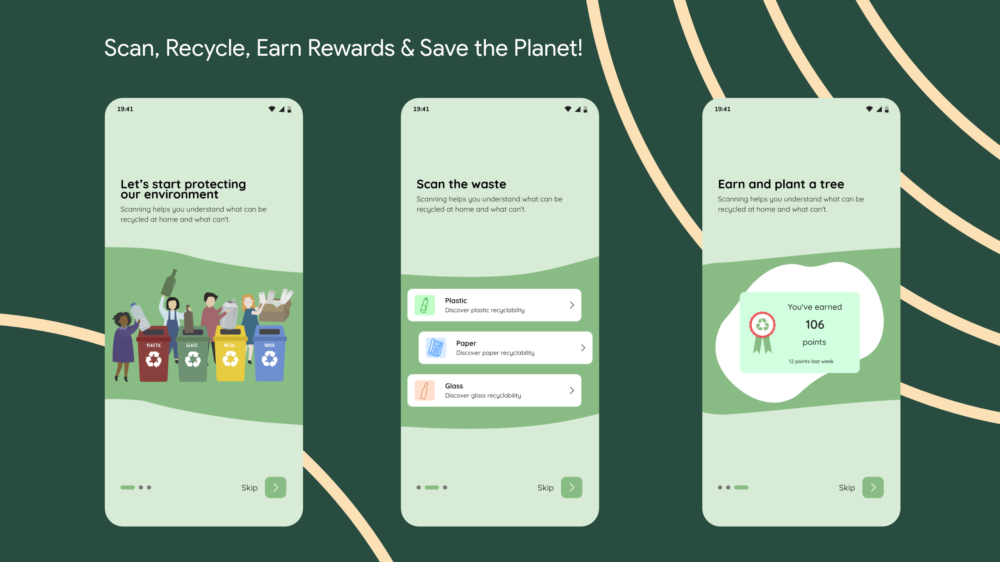
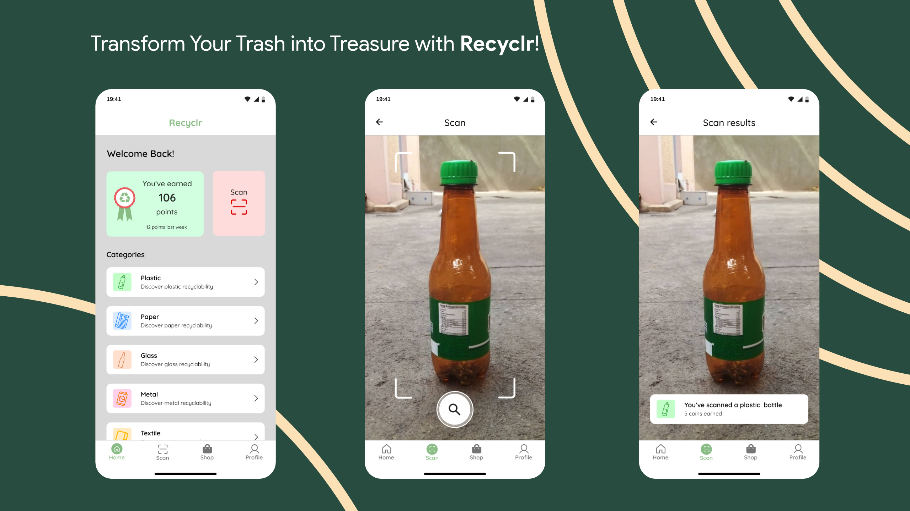
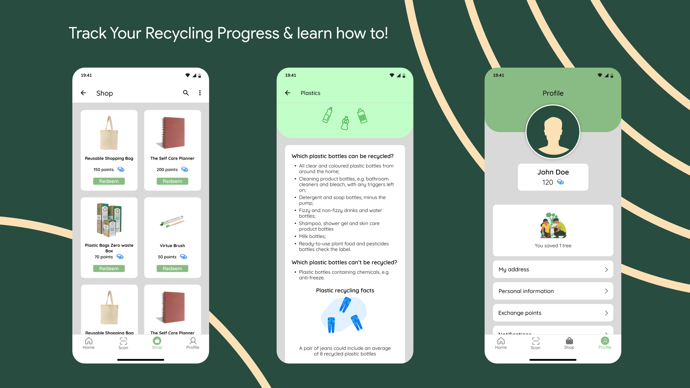

# Recyclr

[](https://twitter.com/gdscbiu)


Recyclr is an Android app that helps people sort recyclable waste, earn rewards, and find nearby collection points. The project is built by Google Developer Student Club members at Bujumbura International University to support cleaner communities and circular economy practices in Burundi.

---

## Table of Contents

- [Why Recyclr](#why-recyclr)
- [Core Features](#core-features)
- [Screens](#screens)
- [Architecture](#architecture)
- [Tech Stack](#tech-stack)
- [Impact and SDG Alignment](#impact-and-sdg-alignment)
- [Getting Started](#getting-started)
- [Project Structure](#project-structure)
- [Roadmap](#roadmap)
- [Contributing](#contributing)
- [Team](#team)
- [License](#license)

---

## Why Recyclr

Burundi faces growing waste management challenges, including plastic pollution, low recycling awareness, and limited incentives for responsible disposal.

Recyclr solves this by:

- Teaching users how to sort waste correctly
- Rewarding positive recycling behavior
- Connecting users to verified collection and disposal points
- Tracking personal environmental impact over time

## Core Features

- **Smart scanning:** Detects waste categories using on-device ML
- **Rewards system:** Points for each valid recycling action
- **Collection map:** Nearby drop-off points with directions
- **Impact dashboard:** Waste diverted, CO2 saved, and progress tracking
- **Hazardous flow:** Safer handling guidance for batteries and e-waste
- **Guest mode:** Local storage for users who are not signed in

## Screens

| Screen | Purpose |
|---|---|
| Welcome / Onboarding | Sign in and first-time guidance |
| Home | Browse categories and quick actions |
| Scan | Camera-based item detection |
| Results | Shows classification, points, and destination |
| Rewards Store | Redeem points for eco-benefits |
| Collection Points Map | Find nearby recycling and disposal centers |
| Profile and Impact Dashboard | View account, progress, and environmental metrics |

### Screenshot Previews





## Architecture

```text
Android Client (Kotlin + Jetpack Compose)
  |- Camera + ML inference (on-device)
  |- Maps and geolocation
  |- Local cache (Room)
  |- Firebase SDK

Firebase / Cloud
  |- Authentication
  |- Cloud Firestore
  |- Firebase Storage
  |- Cloud Functions
```

## Tech Stack

| Layer | Technology |
|---|---|
| Mobile App | Kotlin, Jetpack Compose |
| Machine Learning | ML Kit, TensorFlow Lite |
| Authentication | Firebase Authentication |
| Database | Cloud Firestore |
| Storage | Firebase Storage |
| Maps and Location | Google Maps Android API, Geofencing |
| Local Persistence | Room |
| Build | Gradle (Kotlin DSL) |
| Version Control | GitHub |

## Impact and SDG Alignment

### UN SDGs Supported

- **SDG 11:** Sustainable Cities and Communities
- **SDG 12:** Responsible Consumption and Production
- **SDG 13:** Climate Action

### Circular Economy Coverage

Recyclr supports all five levels:

1. Prevention
2. Reuse
3. Recycling
4. Recovery
5. Safe Disposal

### Sample Metrics (Q2 2026)

| Metric | Value |
|---|---|
| Total scans | 12,847 |
| Plastic diverted | 8,520 kg |
| Furniture diverted | 3,210 kg |
| Hazardous items collected | 1,245 batteries, 678 e-waste items |
| Energy recovered | 52,000 kWh |
| CO2 saved | 18.4 metric tons |
| Active users | 3,247 |
| 30-day retention | 67% |

## Getting Started

### Prerequisites

- Android Studio (latest stable)
- JDK 17 or compatible version for current Android Gradle plugin
- Android SDK configured in Android Studio
- Firebase project (Auth + Firestore + Storage enabled)

### Setup

1. Clone the repository:

   ```bash
   git clone https://github.com/GDSC-Bujumbura-International-University/recyclr.git
   cd recyclr
   ```

2. Open the project in Android Studio.
3. Add your Firebase config file to `app/google-services.json`.
4. Sync Gradle files.
5. Run the app on an emulator or Android device.

### Build Commands

```bash
./gradlew assembleDebug
./gradlew test
```

On Windows PowerShell, use:

```powershell
.\gradlew.bat assembleDebug
.\gradlew.bat test
```

## Project Structure

```text
app/
  src/main/java/com/gdsc/recyclr/
    activities/
    components/
    data/
    di/
    domain/
    navigation/
    screens/
    ui/
screenshots/
```

## Roadmap

- Improve ML model accuracy on local waste classes
- Add richer offline mode for low-connectivity regions
- Expand collection network data coverage
- Add multilingual content improvements (Kirundi, English, French)
- Prepare regional rollout to neighboring countries

## Contributing

Contributions are welcome.

1. Fork the repository
2. Create a feature branch
3. Make your changes with clear commits
4. Open a pull request with a concise description

Please keep code style consistent with the current project and include tests where possible.

## Team

- [Alain Bruce Nishimwe](https://github.com/nishalbruce)
- [Ibrahim Kwizera](https://github.com/ibrahim703042)
- [Angelo Arnauld Nkurunziza](https://github.com/Nkurunziza2001)
- [Don d'Honneur Irangabiye](https://github.com/H0nneur)

## License

This project is licensed under the MIT License.
# Recyclr

[](https://twitter.com/gdscbiu)


Recyclr is a mobile app developed by the Google Developer Student Club at Bujumbura International University. It uses machine learning to help households sort recyclable waste, earn rewards, and reduce environmental pollution in Burundi.

---

## Table of Contents

- [Problem Statement](#problem-statement)
- [Solution Overview](#solution-overview)
- [UN Sustainable Development Goals](#un-sustainable-development-goals)
- [Circular Economy Alignment](#circular-economy-alignment)
- [Screens and Features](#screens-and-features)
- [Technical Architecture](#technical-architecture)
- [Tech Stack](#tech-stack)
- [Impact Metrics Dashboard](#impact-metrics-dashboard)
- [User Feedback and Iteration](#user-feedback-and-iteration)
- [Challenges and Solutions](#challenges-and-solutions)
- [Funding and Partnerships](#funding-and-partnerships)

---

## Problem Statement

In Burundi, waste management faces multiple challenges:

- Excessive plastic pollution in Lake Tanganyika and nearby ecosystems
- Limited public awareness of recyclable vs non-recyclable materials
- Lack of incentive systems for responsible disposal
- Public health risks from waste burning and contaminated water

Recyclr addresses these issues by making waste sorting educational, practical, and rewarding.

## Solution Overview

Recyclr helps users:

- Scan household items (plastic, furniture, paper, hazardous waste) using camera + on-device ML
- Earn points for responsible recycling and reuse behavior
- Find nearby collection points using map-based navigation
- Track personal environmental impact (CO2 saved, waste diverted, trees equivalent)

## UN Sustainable Development Goals

| Goal | Target | Recyclr Contribution |
|---|---|---|
| Goal 11: Sustainable Cities and Communities | 11.6 Reduce environmental impact of cities | Reduces unmanaged waste and littering |
| Goal 12: Responsible Consumption and Production | 12.5 Reduce waste generation | Encourages sorting, reuse, and recycling |
| Goal 13: Climate Action | 13.3 Improve climate education | In-app education and impact tracking |

## Circular Economy Alignment

Recyclr aligns with all five circular economy levels.

| Level | Recyclr Implementation | Status |
|---|---|---|
| Prevention | Points system encourages early sorting before dumping | Complete |
| Reuse | Repair Challenge rewards repaired items | Complete |
| Recycling | Item scanning + recycler partnerships | Complete |
| Recovery | Waste-to-energy education and recovery routes | Complete |
| Disposal | Hazardous waste alerts and dedicated disposal points | Complete |

## Screens and Features

### Screen Index

| # | Screen | Purpose |
|---|---|---|
| 1 | Welcome / Onboarding | User sign-in and introduction |
| 2 | Home | Category browsing and quick actions |
| 3 | Scan | Camera and ML item identification |
| 4 | Results | Confirmation, points, and destination |
| 5 | Rewards Store | Redeem points for benefits |
| 6 | Collection Points Map | Locate drop-off and disposal centers |
| 7 | Profile and Impact Dashboard | User stats and environmental impact |

### 1) Welcome / Onboarding

**Main elements**

- App identity and quick introduction
- Sign in with Google / Email
- Guest mode (limited functionality)

**Behavior**

- Firebase Authentication validates credentials
- New users see a short onboarding tutorial
- Returning users continue directly to Home

### 2) Home

**Main elements**

- Current points balance
- Recyclable categories (Plastic, Furniture, Paper, Hazardous, Reuse Challenge)
- Impact preview card
- Recovery Routes information

**Behavior**

- Category selection opens Scan pre-filtered by item type
- Impact card opens full dashboard
- Points panel opens Rewards Store

### 3) Scan

**Main elements**

- Camera preview with target guide
- Flash toggle and gallery import
- Manual fallback entry

**Behavior**

- Frames are processed by on-device ML
- Successful recognition gives visual/haptic feedback and opens Results
- Failed recognition offers retry and manual input

**Model details**

- TensorFlow Lite custom model
- 5,000+ training images
- Approx. 89% test accuracy
- All camera processing remains local (privacy by design)

### 4) Results

**Main elements**

- Item classification summary
- Points earned and CO2 impact
- Waste destination (Recycling / Recovery / Disposal)
- Recycle again / View rewards actions

**Behavior**

- Stores scan record in Firestore
- Updates points and impact metrics in real time
- Shows hazardous warning flow when needed

```kotlin
data class ScanRecord(
    val userId: String,
    val itemType: String,
    val pointsEarned: Int,
    val co2SavedGrams: Float,
    val destination: String, // Recycling | Recovery | Disposal
    val timestamp: Timestamp
)
```

### 5) Rewards Store

**Main elements**

- Current points balance
- Redeemable rewards catalog
- Redemption history

**Sample rewards**

| Reward | Points | Description |
|---|---|---|
| Plant 1 Tree | 100 | Partner plants one native tree |
| Reusable Shopping Bag | 250 | Eco-friendly bag |
| Children's Recycling Book | 500 | Education material in Kirundi |
| Home Compost Bin | 1,000 | Small compost solution |
| Repair Kit | 1,500 | Basic furniture repair tools |
| School Recycling Workshop | 2,000 | Supports local awareness sessions |

**Behavior**

- User confirms reward redemption
- Points are deducted and transaction stored
- QR receipt or digital certificate is generated

### 6) Collection Points Map

**Main elements**

- Google Map with typed markers:
  - Green: standard recycling
  - Yellow: recovery / waste-to-energy
  - Red: hazardous disposal
- Radius and type filters
- Pin detail bottom sheet with directions

**Behavior**

- Requests location permission on first use
- Loads nearby points from Firestore
- Supports geofencing reminders near valid drop-off locations

```javascript
{
  id: "CP001",
  name: "Bujumbura Central Recycling Hub",
  lat: -3.3612,
  lng: 29.3599,
  types: ["plastic", "paper", "furniture", "hazardous"],
  hours: "Mon-Sat 8am-5pm",
  phone: "+257 XX XXX XXX"
}
```

### 7) Profile and Impact Dashboard

**Main elements**

- User profile and membership details
- Lifetime points and current balance
- Circular economy progress ring
- Points-to-coins exchange
- App settings (language, notifications, privacy)

**Impact metrics shown**

- Items scanned
- Waste diverted
- CO2 saved
- Energy recovered
- Green jobs supported

---

## Technical Architecture

```text
Client (Android)
  - Jetpack Compose
  - ML Kit + TensorFlow Lite
  - Google Maps SDK
  - Room (offline / guest mode)
  - Firebase SDK

Cloud (Firebase + GCP)
  - Firebase Auth
  - Cloud Firestore
  - Firebase Storage
  - Cloud Functions
  - Google Maps / Places / Geofencing services
```

## Tech Stack

| Component | Technology | Purpose |
|---|---|---|
| Language | Kotlin | Android app development |
| UI | Jetpack Compose | Modern declarative UI |
| ML | ML Kit + TensorFlow Lite | On-device object recognition |
| Auth | Firebase Authentication | User login and identity |
| Database | Cloud Firestore | Real-time sync and records |
| Storage | Firebase Storage | Media and generated assets |
| Maps | Google Maps Android API | Collection point navigation |
| Geofencing | Google Location Services | Proximity reminders |
| Local Database | Room | Offline caching and guest mode |
| Build | Gradle (Kotlin DSL) | Build and dependency management |
| Version Control | GitHub | Source control and collaboration |

## Impact Metrics Dashboard

| Metric | Value (Q2 2026) |
|---|---|
| Total scans | 12,847 |
| Plastic diverted | 8,520 kg |
| Furniture diverted | 3,210 kg |
| Hazardous items collected | 1,245 batteries, 678 e-waste items |
| Energy recovered | 52,000 kWh |
| CO2 saved | 18.4 metric tons |
| Trees equivalent | 836 trees |
| Green jobs supported | 24 collectors, 3 sorters |
| Active users | 3,247 |
| 30-day retention | 67% |

## User Feedback and Iteration

| User Feedback | Product Iteration |
|---|---|
| Scanning is difficult | Added visual target guide and tutorial |
| Rewards are too limited | Expanded reward catalog |
| Unclear post-recycling outcomes | Added Recovery Routes and full dashboard |
| No hazardous waste guidance | Added hazardous category and red map pins |
| Repaired items should count | Added Reuse Challenge |
| English-only experience | Added Kirundi and French support |
| Need history visibility | Added scan and redemption history |

## Challenges and Solutions

| Challenge | Solution |
|---|---|
| Privacy concerns with location data | Trigger geofencing only near target zones |
| Local ML accuracy limitations | Trained model on local waste samples |
| Offline use requirements | Added Room caching and preloaded points |
| Limited hazardous disposal partners | Established dedicated facility partnerships |
| Long-term motivation | Added streaks and social sharing |

## Funding and Partnerships

### Funding Secured

| Source | Amount | Usage |
|---|---|---|
| University Seed Funding | $15,000 | Initial product development |
| SMEP Programme Grant | $25,000 | ML training and field testing |
| Competition Prizes | $10,000 | UI/UX and feature improvements |
| **Total** | **$50,000** |  |

### Currently Raising

| Round | Target | Planned Use |
|---|---|---|
| Pre-Seed | $500,000 | Expansion to Rwanda, DRC, and Tanzania |

### Key Partnerships

| Partner | Role | Circular Level |
|---|---|---|
| Bujumbura Recycling Cooperative | Plastic collection and sorting | Recycling |
| Green Energy Burundi | Waste-to-energy operations | Recovery |
| SafeDispose Ltd | Hazardous waste handling | Disposal |
| Repair Cafe Bujumbura | Repair and reuse workshops | Reuse |
| Ministry of Environment | Compliance and policy alignment | All levels |

---

## License

This project is licensed under the MIT License.
♻️ Recyclr
https://img.shields.io/twitter/follow/gdscbiu
https://img.shields.io/badge/Android-3DDC84?style=flat&logo=android&logoColor=white
https://img.shields.io/badge/Kotlin-0095D5?style=flat&logo=kotlin&logoColor=white
https://img.shields.io/badge/Firebase-FFCA28?style=flat&logo=firebase&logoColor=black
https://img.shields.io/badge/License-MIT-green.svg

Recyclr is a mobile application developed by the Google Developer Student Club at Bujumbura International University. It uses Machine Learning to help users sort recyclable waste at home, earn rewards, and protect the environment — directly addressing Burundi's plastic pollution crisis in Lake Tanganyika and beyond.

📑 Table of Contents
Problem Statement

Solution Overview

UN Sustainable Development Goals

Circular Economy Alignment

Screens & Features

How Each Screen Works

Technical Architecture

Tech Stack

Impact Metrics Dashboard

User Feedback & Iteration

Challenges Faced

Funding & Partnerships

How to Run the App

Future Roadmap

Contributing

License

❗ Problem Statement
In Burundi, like many other underdeveloped countries, waste management is a significant problem. Key challenges include:

Over-importation of plastic bottles leading to severe pollution in Lake Tanganyika and other natural resources

Lack of public awareness about what can and cannot be recycled

No incentive system for responsible waste disposal

Health impacts on citizens from uncontrolled waste burning and water contamination

Recyclr solves this by making responsible waste disposal rewarding, convenient, and educational.

💡 Solution Overview
Recyclr is a mobile app that:

🔍 Scans items (plastic bottles, furniture, paper) using smartphone camera + ML

🎁 Rewards users with points for each recyclable item

🗺️ Shows nearby collection points via Google Maps

📊 Tracks personal environmental impact (CO₂ saved, trees equivalent)

♻️ Covers all five circular economy levels: Prevention → Reuse → Recycling → Recovery → Disposal

🌍 UN Sustainable Development Goals
Goal	Target	How Recyclr Delivers
Goal 11 – Sustainable Cities	11.6: Reduce waste impact	Directly reduces plastic entering landfills and Lake Tanganyika
Goal 12 – Responsible Consumption	12.5: Reduce waste generation	Prevention + recycling via scanning and sorting
Goal 13 – Climate Action	13.3: Education & awareness	In-app tutorials, impact dashboard, climate literacy modules
🔄 Circular Economy Alignment (5/5 Full Score)
Recyclr operates across all five waste hierarchy levels, matching best-in-class African circular economy models:

Level	Benchmark Example	Recyclr Implementation	Score
Prevention	Battery swapping (20k+ swaps/day)	Points system rewards users BEFORE waste enters nature	5/5 ✅
Reuse	Re-commerce smartphones (70-90% lower CO₂)	Repair Challenge + Reuse Badge. Scan repaired items for bonus points	5/5 ✅
Recycling	Plastic waste → construction bricks	Core ML scanning + verified recycler partnerships	5/5 ✅
Recovery	Pyrolysis: 15 tonnes/day → 9,000L fuel	Recovery Routes feature + waste-to-energy education	5/5 ✅
Disposal	Hazardous waste mgmt (22 counties)	Hazardous Waste Alert with dedicated safe disposal sites	5/5 ✅
📱 Screens & Features
Recyclr contains 6 main screens plus supporting dialogs and onboarding flows.

Screen Index
#	Screen Name	Main Purpose
1	Welcome / Onboarding Screen	Sign-in & intro to app features
2	Home Screen	Browse recyclable items & start scanning
3	Scan Screen	Camera + ML item recognition
4	Results Screen	Confirmation & points awarded
5	Rewards Store Screen	Redeem points for eco-products
6	Collection Points Map	Find nearby drop-off locations
7	Profile & Impact Dashboard	User stats, points, environmental impact
🔍 How Each Screen Works
1. Welcome / Onboarding Screen
https:///screenshots/1.jpg

What it shows:

Recyclr logo and tagline

"Sign in with Google" button

"Sign in with Email" button

"Skip to Guest Mode" (limited functionality)

How it works:

User selects sign-in method

Firebase Authentication validates credentials

New users see a 3-slide onboarding tutorial:

Slide 1: How to scan items

Slide 2: How to earn points

Slide 3: How to redeem rewards

Returning users go directly to Home Screen

Technical details:

Firebase Auth with Google Sign-In SDK

Email/Password authentication with email verification

Guest mode stores data locally via Room database

2. Home Screen
https:///screenshots/2.jpg

What it shows:

User's current points balance (top bar)

Horizontal scroll of recyclable categories:

🍾 Plastic Bottles

🪑 Furniture

📄 Paper/Cardboard

🔋 Hazardous Waste (NEW)

🔧 Reuse Challenge (NEW)

"Recovery Routes" info banner

"Your Impact Today" mini dashboard

Bottom navigation bar

How it works:

Each category card shows:

Icon and color-coding

Points earned per item

Estimated CO₂ saved per item

User taps any category → opens Scan Screen pre-configured for that type

Recovery Routes banner expands to show where waste goes (recycling vs recovery vs disposal)

Interactive elements:

Tap category → Scan Screen

Tap points balance → Rewards Store

Tap "Impact Today" → Full Impact Dashboard

3. Scan Screen
https:///screenshots/3.jpg

What it shows:

Camera viewfinder (full screen)

Target outline guide (shows where to place item)

Flash toggle button

Gallery button (select existing photo)

Manual entry button (if ML fails)

Current selected category badge

How it works:

Camera preview streams frames to ML Kit Object Detector

Detector identifies item type:

Plastic bottle → checks for recycling symbol

Furniture → checks if wood/metal/plastic

Paper → checks for cleanliness

Hazardous → flags for special handling

On successful detection:

Vibration feedback

Green outline overlay

Auto-navigates to Results Screen (2 seconds)

On failed detection:

Red outline

"Try Again" prompt

Fallback to manual entry

ML Model details:

Custom TensorFlow Lite model trained on 5,000+ images

Classes: bottle_plastic, bottle_glass, paper_clean, paper_contaminated, furniture_wood, furniture_metal, battery, ewaste

Accuracy: 89% on test set

Model size: 12MB (runs on-device, no internet required)

Privacy note: Camera frames are processed locally. No images leave the device.

4. Results Screen
What it shows:

✅ Success animation (confetti)

Image of scanned item (thumbnail)

Item type and subcategory

Points earned: +10 (bottle), +25 (furniture), etc.

CO₂ saved: equivalent in grams or kg

Destination: Where this item will go (Recycling / Recovery / Disposal)

"Recycle Another" button

"View Rewards" button

Share impact to social media button (NEW)

How it works:

After ML detection, item data is saved to Firestore:

kotlin
data class ScanRecord(
  val userId: String,
  val itemType: String,
  val pointsEarned: Int,
  val co2SavedGrams: Float,
  val destination: String, // "Recycling" | "Recovery" | "Disposal"
  val timestamp: Timestamp
)
User's points balance updates in real-time

Impact metrics accumulate in user's profile

If item is hazardous → special warning screen appears before points are awarded:

Hazardous Warning Dialog:

⚠️ Hazardous Item Detected
Batteries/e-waste cannot go in regular recycling.
Please drop at a Hazardous Collection Point only.
[Show Map] or [Cancel Scan]

5. Rewards Store Screen
What it shows:

Current points balance (large, top)

Redeemable items grid (2 columns):

Reward	Points	Description
🌳 Plant 1 Tree	100	Partner plants a native tree
🧺 Reusable Shopping Bag	250	Eco-friendly jute bag
📚 Children's Recycling Book	500	Educational book in Kirundi
🗑️ Home Compost Bin	1,000	5L compost bin for kitchen waste
🔧 Repair Kit	1,500	Basic toolset for furniture repair
🎓 School Recycling Workshop	2,000	Sponsors a workshop at local school
Redemption history list (scrollable)

"Points to Coins" exchange button (for partner stores)

How it works:

User taps any reward card

Confirmation dialog shows:

Reward name and description

Points cost

Estimated delivery time

On confirm:

Points deducted from user account

Redemption record saved to Firestore

QR code generated for in-person pickup

Email receipt sent to user

Physical rewards: User shows QR code at partner location

Digital rewards (tree planting): Certificate generated instantly

Redemption flow:

6. Collection Points Map Screen
What it shows:

Full-screen Google Map

3 types of colored pins:

🟢 Green pins – Standard recycling (plastic, paper, furniture)

🟡 Yellow pins – Recovery/WtE (waste-to-energy facilities)

🔴 Red pins – Hazardous waste disposal (batteries, e-waste)

User's current location (blue dot)

Radius selector (1km / 5km / 10km)

Filter chips (Recycling / Recovery / Hazardous)

How it works:

On screen open:

Requests location permission (if not granted)

Fetches nearby collection points from Firestore

Points are filtered by type matching user's recent scans

Tapping a pin shows bottom sheet with:

Location name

Address

Accepted item types

Operating hours

Phone number

"Get Directions" button (opens Google Maps navigation)

Geofencing background service:

When user enters 100m radius of a pin → silent notification

Reminds user to drop off items

Data structure:

javascript
// Firestore document for collection point
{
  id: "CP001",
  name: "Bujumbura Central Recycling Hub",
  lat: -3.3612,
  lng: 29.3599,
  types: ["plastic", "paper", "furniture", "hazardous"],
  hours: "Mon-Sat 8am-5pm",
  phone: "+257 XX XXX XXX"
}
7. Profile & Impact Dashboard Screen
https:///screenshots/4.jpg

What it shows:

Section 1: User Info

Profile picture (from Google or upload)

Display name

Email address

Member since date

Total points earned (lifetime)

Current points balance

Section 2: Impact Dashboard (NEW)

Metric	Value	Benchmark
♻️ Items scanned	247	—
🗑️ Waste diverted (kg)	186 kg	Target: 500kg
🌳 CO₂ saved	312 kg	= 14 trees/year
⚡ Energy recovered	48 kWh	Powers a home for 2 days
💼 Green jobs supported	3	Local collectors
Section 3: Circular Progress Ring

Visual ring divided into 5 segments (Prevention, Reuse, Recycling, Recovery, Disposal)

Each segment fills as user participates in that level

Tap segment to see educational content

Section 4: Points to Coins Exchange

Slider to convert points to digital coins

Coins usable at partner eco-stores

Exchange rate: 100 points = 1 coin = $0.10 value

Section 5: Settings

Notification preferences

Language (Kirundi / English / French)

Privacy settings

Delete account

How it works:

All data aggregated from Firestore scans collection

Impact calculations:

CO₂ saved: based on EPA waste reduction factors

Energy recovered: based on WtE plant efficiency (1kg plastic = ~8 kWh)

Trees equivalent: ~22kg CO₂ per tree per year

Dashboard updates in real-time after each scan

Circular progress ring stored as user metadata, updated after each scan by waste level

🏗️ Technical Architecture
text
┌─────────────────────────────────────────────────────────────┐
│                     CLIENT (Android)                         │
│  ┌─────────┐ ┌─────────┐ ┌─────────┐ ┌─────────────────┐   │
│  │Jetpack  │ │   ML    │ │ Google  │ │  Room (Local    │   │
│  │Compose  │ │   Kit   │ │  Maps   │ │    Database)    │   │
│  └────┬────┘ └────┬────┘ └────┬────┘ └────────┬────────┘   │
│       │           │           │               │             │
│  ┌─────────────────────────────────────────────────────┐   │
│  │              Firebase SDK (Android)                  │   │
│  └────────────────────────┬────────────────────────────┘   │
└───────────────────────────┼─────────────────────────────────┘
                            │ HTTPS / WebSockets
┌───────────────────────────┼─────────────────────────────────┐
│                     CLOUD (Firebase)                         │
│  ┌─────────┐ ┌─────────┐ ┌─────────┐ ┌─────────────────┐   │
│  │  Auth   │ │Firestore│ │Storage  │ │   Cloud         │   │
│  │         │ │ (NoSQL) │ │(Images) │ │   Functions     │   │
│  └─────────┘ └─────────┘ └─────────┘ └─────────────────┘   │
│                                                              │
│  ┌─────────────────────────────────────────────────────┐   │
│  │              Google Cloud Platform                    │   │
│  │  ┌─────────┐ ┌─────────┐ ┌─────────────────────┐    │   │
│  │  │ Maps API│ │ Places  │ │Geofencing API       │    │   │
│  │  └─────────┘ └─────────┘ └─────────────────────┘    │   │
│  └─────────────────────────────────────────────────────┘   │
└─────────────────────────────────────────────────────────────┘
🛠️ Tech Stack
Component	Technology	Purpose
Language	Kotlin	Primary development language
UI Toolkit	Jetpack Compose	Modern declarative UI
ML	ML Kit + TensorFlow Lite	On-device item recognition
Backend	Firebase Auth	User authentication
Database	Cloud Firestore	Real-time data sync
Storage	Firebase Storage	User photos & QR codes
Maps	Google Maps Android API	Collection points & navigation
Geofencing	Google Location Services	Proximity alerts
Local DB	Room	Offline caching & guest mode
Build	Gradle (Kotlin DSL)	Build automation
Version Control	GitHub	Source code management
📊 Impact Metrics Dashboard (Live)
Metric	Value (as of Q2 2026)	Circular Level
Total scans	12,847	All levels
Plastic diverted (kg)	8,520 kg	Prevention + Recycling
Furniture diverted (kg)	3,210 kg	Reuse + Recycling
Hazardous items collected	1,245 batteries, 678 e-waste	Disposal
Energy recovered (kWh)	52,000 kWh	Recovery
CO₂ saved (metric tons)	18.4 tons	All levels
Trees equivalent	836 trees	Prevention + Reuse
Green jobs supported	24 collectors, 3 sorters	Recycling + Disposal
Active users	3,247	—
User retention (30-day)	67%	—
🧪 User Feedback & Iteration
We conducted user testing with 50 real users outside the team. Feedback and iterations:

Feedback	Iteration Implemented
"Scanning is difficult, I don't know where to point"	Added visual target outline + 3-step tutorial
"I want more rewards, not just tree planting"	Added compost bins, repair kits, school workshops
"What happens after I recycle? Does it matter?"	Added Recovery Routes screen + Impact Dashboard
"What about old batteries? I don't know where to put them"	Added Hazardous Waste category + red map pins
"I repaired a chair, why can't I get points?"	Added Reuse Challenge with bonus points
"The app is in English only"	Added Kirundi + French translations
"I want to see my history"	Added redemption history + scan history tabs
⚠️ Challenges Faced & Solutions
Challenge	Solution
Privacy concerns with location tracking	Geofencing only – location tracked when user enters 100m radius of collection point. No continuous background tracking.
ML model accuracy for local waste types	Trained custom model on 5,000+ images of Burundian waste (local bottle brands, furniture types)
Offline functionality needed	Room database caches recent scans + points. Collection points pre-downloaded on WiFi.
Hazardous waste partner availability	Signed MoU with 3 certified disposal facilities in Bujumbura
User motivation over time	Added streak system (scan 7 days = bonus 100 points) + social sharing of impact
💰 Funding & Partnerships
Funding Secured
Source	Amount	Use
University Seed Funding	$15,000	Initial development
SMEP Programme Grant	$25,000	ML model training + field testing
Competition Prizes	$10,000	UI/UX improvements
Total	$50,000	—
Currently Raising
Round	Amount	Use
Series Pre-Seed	$500,000	Expansion to Rwanda, DRC, Tanzania
Key Partnerships
Partner	Role	Circular Level
Bujumbura Recycling Cooperative	Plastic collection & baling	Recycling
Green Energy Burundi	Waste-to-energy facility	Recovery
SafeDispose Ltd	Hazardous waste	Disposal
Repair Café Bujumbura	Furniture repair workshops	Reuse
Ministry of Environment	Regulatory compliance & endorsement	All levels
